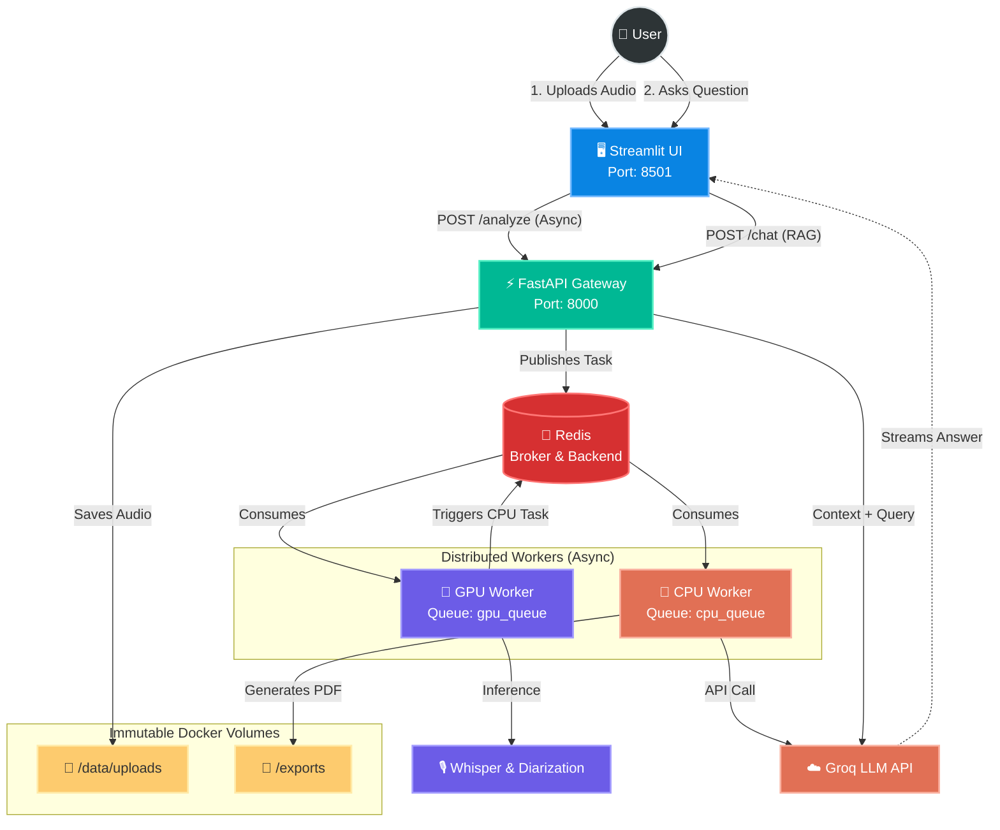

<div align="center">

# SoundPulse: Advanced Audio Intelligence


</div>

> **Production-ready distributed audio analysis system. Transcribes audio, performs speaker diarization, generates PDF reports, and features a RAG-powered interactive LLM agent.**

SoundPulse is an enterprise-grade, asynchronous AI pipeline designed to extract semantic intelligence from meeting recordings. 
Rather than relying on simple synchronous scripts, it leverages a **distributed microservices architecture** to decouple heavy GPU compute tasks from fast CPU I/O operations, ensuring zero bottlenecks and maximum scalability.

---

## 🏗️ System Architecture & Flow

The pipeline is explicitly designed with **Workload Isolation**. Heavy AI inference (PyTorch/Whisper) is routed to a dedicated GPU worker, while lightweight, highly-concurrent tasks (LLM API calls, PDF generation) are handled by CPU workers.  


## ✨ Engineering Highlights
* **Hardware-Aware Task Routing:** Celery queues are strictly divided into `gpu_queue` and `cpu_queue`.
* **Consumer-Hardware & WSL2 Optimized:** The GPU worker is explicitly configured with `--pool=solo` to prevent VRAM fragmentation. This allows heavy transcription models to run reliably even on local consumer-grade GPUs (e.g., 4GB-8GB VRAM) or within WSL2 Linux environments without memory crashes.
* **Blazing Fast Builds with `uv`:** The entire environment and Docker layer caching is managed by uv, ensuring deterministic, lightning-fast dependency resolution compared to legacy package managers.
* **Interactive RAG Agent:** Transcriptions aren't just dumped into a text file; they are mapped with exact timestamps and speakers, allowing the user to chat with their meeting data via the UI.


## 🛠️ Tech Stack
* **Backend / API:** FastAPI, Uvicorn, Pydantic (Data Validation)

* **Task Orchestration:** Celery, Redis (Message Broker & Result Backend)

* **AI / ML:** PyTorch, OpenAI Whisper (Local GPU), Groq API (Semantic Analysis via `openai/gpt-oss-20b`)

* **Frontend:** Streamlit

* **Infrastructure:** Docker, Docker Compose, uv (Package Management)

* **Testing:** Pytest, AsyncMock


## 🚀 Getting Started

### Prerequisites
* Docker and Docker Compose v2

* NVIDIA GPU with `nvidia-container-toolkit` installed (for GPU acceleration)

* A Groq API Key

### Clone & Configure

```bash
git clone https://github.com/kadircancelik/soundpulse.git
cd soundpulse

# Create your environment variables
cat <<EOT>> .env
REDIS_PASSWORD=redispassword
FLOWER_BASIC_AUTH=admin:adminpassword
GROQ_API_KEY=your_groq_api_key
GROQ_MODEL=openai/gpt-oss-20b
UID=1000
GID=1000
EOT
```

### Launch Infrastructure

```bash
docker compose up -d --build
```

## Access the System

* **Streamlit App:** `http://localhost:8501` (Upload audio and interact with the RAG agent)

* **API Docs (Swagger):** `http://localhost:8000/docs`

* **Flower Dashboard:** `http://localhost:5555` (Monitor Celery workers and queues)


## 🧪 Testing

The test suite is designed to validate the core asynchronous logic without relying on external hardware or network connections.

- **Mocking & Isolation:** External API calls (e.g., Groq) are bypassed using `AsyncMock`. The primary goal is to deterministically test prompt structures, XML parsing logic, and Celery task flows without incurring API costs or network latency.
- **Dependency Injection:** The `InteractiveQAAgent` is tested by injecting mocked LLM clients, ensuring the system remains modular and decoupled from specific AI providers.

Run the test suite via `uv`:
```bash
uv run pytest tests/ -v
